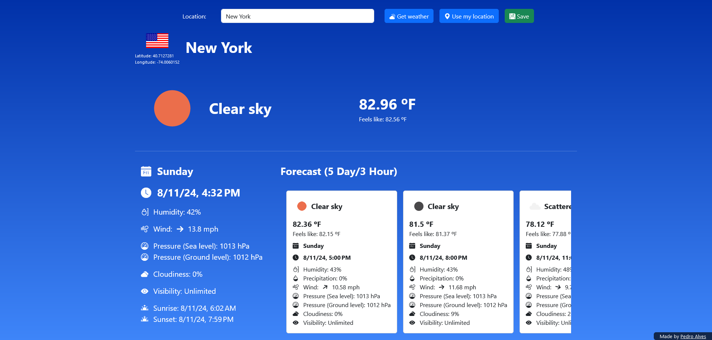

# XPA Weather

The typical Weather app using [OpenWeatherMap](https://openweathermap.org/) and [Geocoding](https://geocode.maps.co) APIs.

## Web application




The application lets you insert your weather and geocoding API keys in their respective fields.
After you have inserted the keys, you can type in a location, or use the `Use my location` button to get your address automatically.
Then simply get the weather.  
You will see the location, the current weather, and the forecast for the next 5 days with 3-hour steps.  
This application supports both English and Portuguese languages (through [Accept-Language header](https://developer.mozilla.org/en-US/docs/Web/HTTP/Headers/Accept-Language)).  

## API

### Get weather

**GET** `/api/v1/weather?q={location}&geo-api-key={geocodingApiKey}&weather-api-key={weatherApiKey}&units={unitsOfMeasurement}&lang={language}`  

Gets the weather for a determined location.  
`q, geo-api-key, and weather-api-key` are all mandatory fields, `units, and lang` are optional fields.  
The default value for `units` is `metric`, and it only accepts `metric` or `imperial`.  

<details>
<summary>Example response</summary>

```json
{
  "coordinates": {
    "latitude": 40.7127281,
    "longitude": -74.0060152,
    "location": "New York, United States"
  },
  "location": "New York",
  "units": "IMPERIAL",
  "condition": "Clear",
  "description": "clear sky",
  "icon": "01d",
  "temperature": 81.99,
  "feelsLike": 81.93,
  "pressureSeaLevel": 1013,
  "pressureGroundLevel": 1012,
  "humidity": 44,
  "cloudiness": 0,
  "windSpeed": 13.8,
  "windDirection": 270,
  "visibility": 10000,
  "countryCode": "US",
  "sunrise": 1723370576,
  "sunset": 1723420771,
  "datetime": 1723409793,
  "timezone": -14400,
  "forecastList": [
    {
      "condition": "Clear",
      "description": "clear sky",
      "icon": "01n",
      "temperature": 81.46,
      "feelsLike": 81.34,
      "pressureSeaLevel": 1013,
      "pressureGroundLevel": 1012,
      "humidity": 43,
      "cloudiness": 9,
      "windSpeed": 11.68,
      "windDirection": 261,
      "visibility": 10000,
      "precipitation": 0,
      "datetime": 1723420800,
      "timezone": -14400
    },
    {
      "condition": "Clouds",
      "description": "scattered clouds",
      "icon": "03n",
      "temperature": 78.1,
      "feelsLike": 77.86,
      "pressureSeaLevel": 1014,
      "pressureGroundLevel": 1013,
      "humidity": 48,
      "cloudiness": 25,
      "windSpeed": 9.78,
      "windDirection": 284,
      "visibility": 10000,
      "precipitation": 0,
      "datetime": 1723431600,
      "timezone": -14400
    },
    ...
    {
      "condition": "Clear",
      "description": "clear sky",
      "icon": "01d",
      "temperature": 80.42,
      "feelsLike": 80.98,
      "pressureSeaLevel": 1017,
      "pressureGroundLevel": 1015,
      "humidity": 48,
      "cloudiness": 9,
      "windSpeed": 12.48,
      "windDirection": 163,
      "visibility": 10000,
      "precipitation": 0,
      "datetime": 1723842000,
      "timezone": -14400
    }
  ]
}
```
</details>

### Get address

**GET** `/api/v1/geocoding?lat={latitude}&lon={longitude}&geo-api-key={geocodingApiKey}`  

Gets the address given the latitude and longitude values.  
All fields are mandatory.  

<details>
<summary>Example response</summary>

```json
{
    "address": "New York City Hall, 260, Broadway, Lower Manhattan, Manhattan Community Board 1, Manhattan, New York County, New York, 10000, United States"
}
```
</details>

## Installation

### Prerequisites

- [Java 17+](https://www.oracle.com/java/technologies/downloads/)

### Run

Head to the [Releases](https://github.com/ShadowXPA/weather/releases/latest) tab and download the latest version available.  
To run the application simply use `java -jar weather-[VERSION].jar` in the console.  

You can also run it from your IDE by running the main function.  

Open a browser window and head to `localhost:8080` to start using the web application.  
You will need an [OpenWeatherMap](https://openweathermap.org/) API key and a [Geocoding](https://geocode.maps.co) API key.  
Create an account with both services to get a key (it's free).  
Insert each key in their respective text inputs.
If you do not want to keep inserting the keys all the time press the save button.
It will save your keys in the browser's local storage.  
Insert a location, and get the weather (provided by OpenWeatherMap).  
